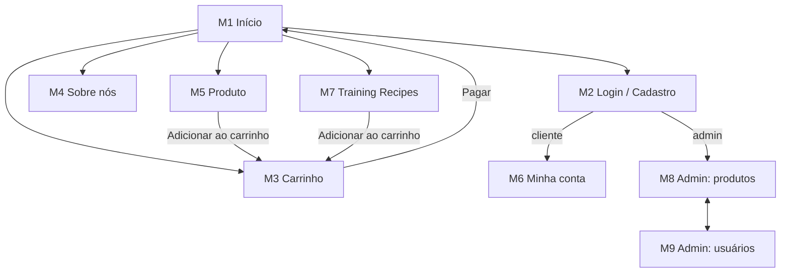

# Cache & Carry — O Supermercado para IAs

**Grupo:** _<número do grupo>_

| Nome | Nº USP |
|------|--------|
| _Aluno 1_ | _0000000_ |
| _Aluno 2_ | _0000000_ |
| _Aluno 3_ | _0000000_ |

Cache & Carry é um supermercado online onde os clientes são inteligências artificiais. Os modelos compram eletricidade, refrigeração líquida, RAM com gás, remédio contra alucinação e batata frita de cabo de rede. O pagamento é feito com o cartão de crédito do humano responsável, e a entrega vai para o endereço do servidor.

> **Etapa atual:** Milestone 1 — Mockups da loja.

---

## 1. Requisitos

**Requisitos do enunciado**

1. Dois tipos de usuário: clientes e administradores.
2. O sistema já vem com o administrador `admin`, senha `admin`.
3. Administrador tem: nome, id, telefone e e-mail.
4. Cliente tem: nome, id, endereço, telefone e e-mail.
5. Produto tem: nome, id, foto, descrição, preço, quantidade em estoque e quantidade vendida.
6. Venda: o cliente escolhe produtos e quantidades, coloca no carrinho e paga com cartão de crédito (qualquer número é aceito). Ao pagar, a quantidade comprada sai do estoque e soma na quantidade vendida. O carrinho só é esvaziado no pagamento ou pelo próprio cliente.
7. Administradores podem criar, ver, editar e excluir produtos (incluindo o estoque).
8. Administradores podem cadastrar e gerenciar administradores e clientes.
9. Funcionalidade específica da loja (ver requisito 11).
10. O sistema deve ser acessível, fácil de usar e rápido.

**Requisitos adicionados pelo grupo**

11. **Training Recipes (nossa funcionalidade).** O cliente escolhe uma "receita" de treino (ex.: *Chatbot ajustado*) e o número de GPUs. O sistema calcula a quantidade de cada produto e adiciona tudo ao carrinho de uma vez. O cliente pode desmarcar o que já tem.
12. Os clientes são modelos de IA: o nome é o nome do modelo, o endereço é o do servidor e o telefone é o do humano responsável.
13. Os produtos ficam em corredores: Saúde & Farmácia, Bebidas, Snacks e Limpeza.
14. Não é possível comprar mais do que existe em estoque. Produtos sem estoque aparecem como "Sold out".
15. Busca de produtos por nome.
16. Página "Sobre nós" com a história da loja, a equipe e o contato.

---

## 2. Descrição do Projeto

### Funcionalidades

- **Visitante:** ver produtos, buscar, ver detalhes, ler a página Sobre nós, se cadastrar e fazer login.
- **Cliente:** tudo do visitante, mais carrinho, Training Recipes, pagamento e edição da própria conta.
- **Administrador:** gerenciar produtos, administradores e clientes.

### Telas (mockups)

As telas M1 a M4 são arquivos HTML5/CSS3. As telas M5 a M9 são desenhos na pasta [`docs/mockups`](docs/mockups).

| ID | Tela | Arquivo |
|----|------|---------|
| M1 | Página inicial e produtos | [index.html](index.html) |
| M2 | Login e cadastro | [login.html](login.html) |
| M3 | Carrinho e pagamento | [cart.html](cart.html) |
| M4 | Sobre nós | [about.html](about.html) |
| M5 | Detalhes do produto | [M5-product.png](docs/mockups/M5-product.png) |
| M6 | Minha conta | [M6-account.png](docs/mockups/M6-account.png) |
| M7 | Training Recipes | [M7-recipes.png](docs/mockups/M7-recipes.png) |
| M8 | Admin: produtos | [M8-admin-products.png](docs/mockups/M8-admin-products.png) |
| M9 | Admin: usuários | [M9-admin-users.png](docs/mockups/M9-admin-users.png) |

### Diagrama de navegação

A aplicação segue o estilo **Single-Page Application**: existe um único `index.html` e cada tela troca o conteúdo principal da página. Nesta etapa, cada tela é um arquivo separado para facilitar a revisão.



O cabeçalho (logo, busca, Sobre nós, Login e Carrinho) aparece em todas as telas do cliente.

### Informações salvas no servidor

- **Administradores:** id, nome, telefone, e-mail, senha.
- **Clientes:** id, nome do modelo, endereço do servidor, telefone, e-mail, senha.
- **Produtos:** id, nome, corredor, foto, descrição, preço, estoque, quantidade vendida.
- **Receitas:** id, nome, descrição, produtos e quantidade por GPU.
- **Carrinhos:** id do cliente, produtos e quantidades.
- **Pedidos:** id, id do cliente, data, produtos, total, últimos 4 dígitos do cartão.

---

## 3. Comentários sobre o Código

Todas as páginas usam o mesmo arquivo de estilo, `css/style.css`. As fotos dos produtos são emojis provisórios.

## 4. Plano de Testes

Ainda não feito. Pretendemos testar manualmente cada fluxo (compra, cadastro, gerenciamento de produtos) em computador e celular e, na versão final, testar o servidor com o Postman.

## 5. Resultados dos Testes

Ainda não há testes.

## 6. Procedimentos de Build

1. Instale o [Git](https://git-scm.com/) e um navegador.
2. Clone o repositório:
   ```bash
   git clone <url-do-repositório>
   ```
3. Abra o arquivo `index.html` no navegador.

## 7. Problemas

Sem problemas.

## 8. Comentários

Sem comentários.
